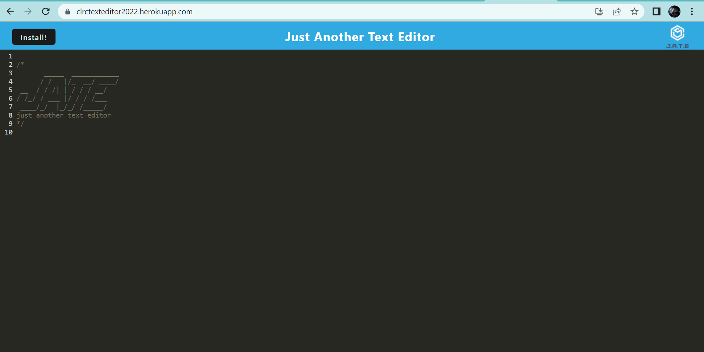
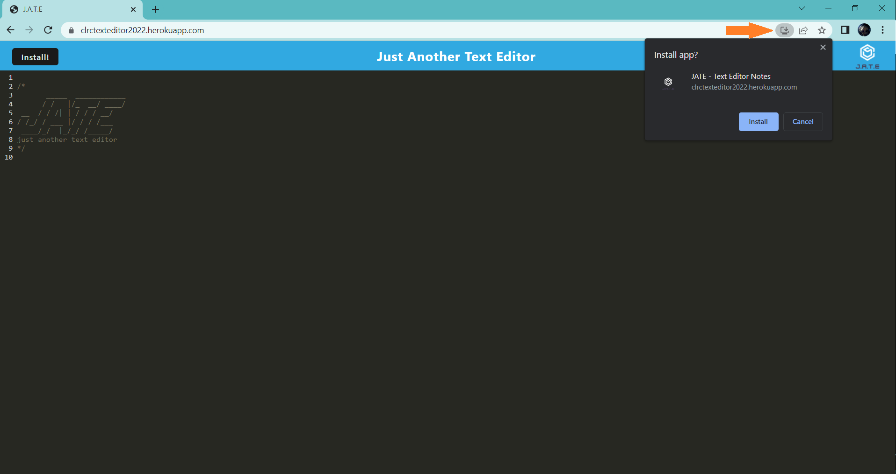
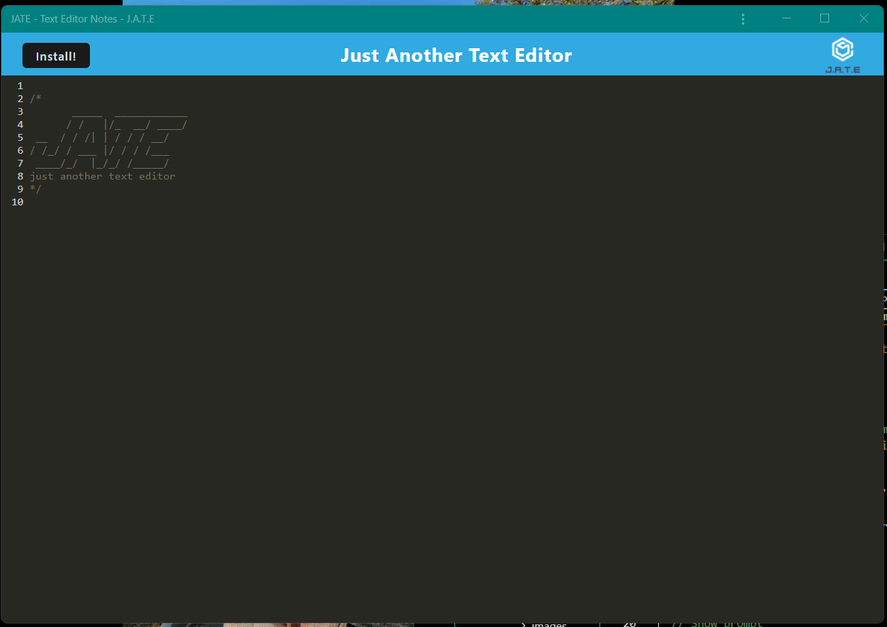

# The Text Editor

## Application Description 
This is a web-based Text Editor that is deployed on Heroku and designed to be a Pregressive Web Application (PWA). You can check out the application [here](https://clrctexteditor2022.herokuapp.com/) and you can also reference the github [repository](https://github.com/ChannellNumber5/CR-TextEditor).

## Table of Contents
- [Steps for Install](#steps-for-install)
- [Usage Instructions](#user-instructions)
- [Contributions](#contribution-guidelines)
- [Licensing](#licensing)
- [Questions](#questions)

## Steps for Install
Unfortunately, the install button on the site page is not working at the moment, but! The Editor can be installed and used offline by clicking on the download button in the url address bar.

## User Instructions
Once the user has navigated to the deployed page, they just need to start typing. All of their text is automatically saved. And, as was stated above, to install onto their phone or desktop, the user just needs to click the "download" icon in the address bar.

Here are screenshots of the browser application and downloading it to the desktop:

And here is a screenshot of the desktop application:

## Contribution Guidelines
UW Coding Bootcamp can be credited for the text editor base code (see initial commit code in repository).

## Licensing
This project is covered under the MIT license. Here is the [link](https://opensource.org/licenses/MIT) for more information about this license type.

## Questions
If you have additional questions you contact via GitHub at [ChannellNumber5](https://github.com/ChannellNumber5). Also, you can email your inquiries to [CLRCoding@gmail.com]("mailto:CLRCoding@gmail.com") or find me on [linkedIn](https://www.linkedin.com/in/channellnumber5/)
    